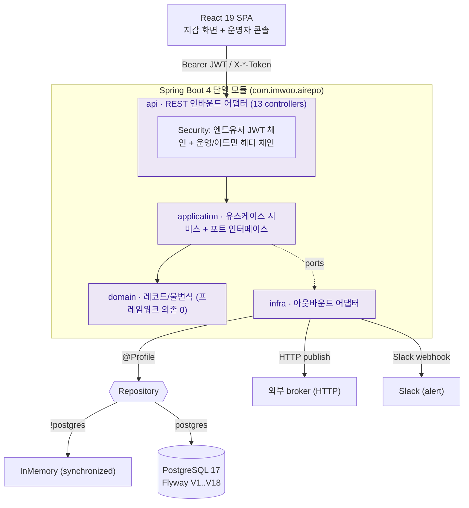
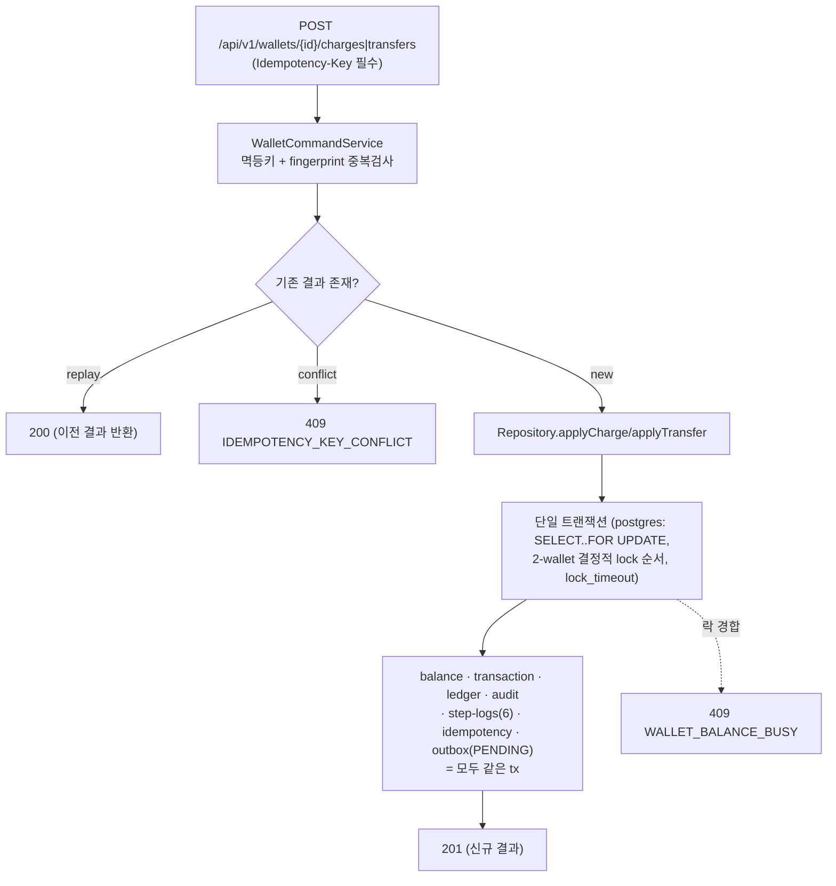
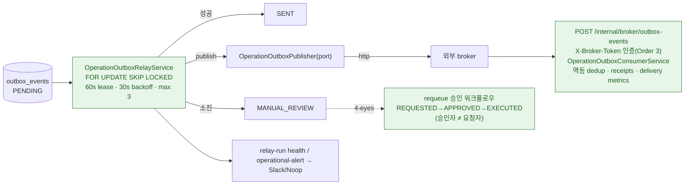
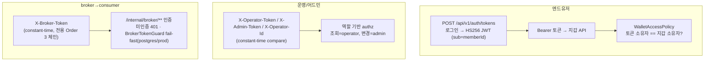

# Architecture Overview

> ai-repo는 Java 25 / Spring Boot 4 기반 **지갑-원장(wallet-ledger) 학습 랩**입니다. 이 문서는 13개 컨트롤러·트랜잭셔널 아웃박스·릴레이/컨슈머로 이루어진 시스템의 전체 구조와 데이터 흐름을 한눈에 보여줍니다. 개별 결정 근거는 [ADR Index](adr/README.md)를, 용어는 [Glossary](GLOSSARY.md)를, 실행은 [Getting Started](GETTING-STARTED.md)를 참고하세요.

## 1. 시스템 구성

**핵심 성질**: 단일 Gradle 모듈이지만 내부는 헥사고날(ports & adapters)로 정리돼 있습니다. `domain`은 프레임워크 의존이 없고, `application`이 포트(인터페이스)를 정의하며, `infra`가 어댑터를 구현합니다. 어댑터는 Spring **profile**(`postgres` / `!postgres`)과 `@ConditionalOnProperty`로 교체됩니다.

## 2. 레이어와 책임

| 레이어 | 패키지 | 책임 | 예시 |
| --- | --- | --- | --- |
| api | `wallet.api` | REST 인바운드 어댑터 + 시큐리티 | `WalletCommandController`, `AuthTokenController`, `SecurityConfig`, `WalletApiExceptionHandler` |
| application | `wallet.application` | 유스케이스 서비스 + 포트 인터페이스 | `WalletCommandService`, `OperationOutboxRelayService`, `WalletCommandRepository`(port), `OperationOutboxPublisher`(port) |
| domain | `wallet.domain` | 애그리거트/값객체/열거형 + 불변식 | `WalletAccount`, `WalletBalance`, `Money`, `LedgerEntry`, `AuditEvent`, `OperationOutboxEvent` |
| infra | `wallet.infra` | 아웃바운드 어댑터 (DB·HTTP·Slack) | `JdbcWalletRepository`, `InMemoryWalletRepository`, `HttpOperationOutboxPublisher`, `JwtAuthTokenService` |
| config | `wallet.config` | 빈 배선 | `AuthBeansConfig`, `TimeConfig`(Clock), `JwtSecretGuard` |

> ⚠️ 알려진 구조 냄새: `JdbcWalletRepository`가 ~11개 포트를 한 클래스(1959줄)로 구현하는 **god-adapter**입니다. 포트별 어댑터 분해가 최우선 리팩터 대상입니다.

## 3. 명령 흐름 — 충전/송금 (원자성)

성공한 모든 이체/충전은 **잔액·거래·원장·감사·스텝로그·멱등레코드·아웃박스 이벤트(PENDING)를 하나의 트랜잭션**으로 기록합니다. 이것이 트랜잭셔널 아웃박스의 핵심 — 상태 변경과 이벤트 발행 의도가 원자적으로 커밋됩니다.

## 4. 아웃박스 릴레이 → 브로커 → 컨슈머

- **릴레이**: 리스 기반 claim(`FOR UPDATE SKIP LOCKED`), 30초 백오프, 최대 3회 → 소진 시 `MANUAL_REVIEW`.
- **4-eyes requeue**: 승인자/반려자는 요청자와 달라야 함. 직접 requeue API는 `410 Gone`으로 폐기(ADR-0040).
- **컨슈머**: `@Transactional`, processed-event dedup, receipt/delivery metric 기록, 스키마 버전 1.
- **관측/운영**: relay-run health, consumer 지표, operational-alert(중복 suppression) → Slack/Noop, admin API 접근 감사, 스케줄러 기반 pruning(모두 기본 비활성).
- **로그**: 기본은 PLG(Loki) 파드 로그 수집이며, 학습용 **opt-in ELK 대안**(Filebeat→Logstash→ES→Kibana)을 병존 스택으로 둘 수 있다(ArgoCD 미포함, 수동 기동). → [ELK 학습 문서](learning/elk-stack.md)

## 5. 시큐리티 체인

- 엔드유저: HS256 JWT(subject=memberId), TTL, active-member 게이팅, 서비스 계층 소유권 검사. `JwtSecretGuard`가 기본 secret 차단.
- 운영/어드민: 헤더 토큰 기반(상수시간 비교). ⚠️ 현재 운영자 신원은 **헤더 기반이라 위조 가능** — 진짜 운영자 principal화는 개선 후보.
- broker→consumer: shared secret `X-Broker-Token`(상수시간 비교, 전용 `SecurityFilterChain` Order 3), 미인증 401. publisher가 같은 secret 부착, `BrokerTokenGuard`가 배포 프로파일(`postgres`/`prod`)에서 기본 토큰을 차단. (ADR-0065)

## 6. 영속성

- **프로필**: 기본 `InMemory`(synchronized), `postgres` 프로필에서 `Jdbc`(행 잠금). H2는 테스트 기본.
- **동시성**: `SELECT..FOR UPDATE` + 2-wallet 결정적 lock 순서 + `SET LOCAL lock_timeout` → 경합 시 `WALLET_BALANCE_BUSY`. 멀티 인스턴스 안전성은 postgres 프로필에서만 성립.
- **스키마**: Flyway `V1..V18` (`src/main/resources/db/migration`). 기본 실행(H2)은 `spring.flyway.enabled=false`.

## 7. 프런트엔드

React 19 + Vite 7 SPA. 로그인 + Bearer(sessionStorage, 1회 401 재시도), 충전/송금, 운영자 manual-review 콘솔. vitest 11 + Playwright 6. ⚠️ 현재 `App.tsx` 한 파일 ~1007줄(useState ~25개)로 모놀리식 — 분해 후보.

## 8. 정직한 단순화 (설계 vs 현실)

| 항목 | 현재 상태 |
| --- | --- |
| 복식부기 | 송금은 양측이지만 **충전은 단측** — house/정산 계정 없이 잔액이 생성됨. 전역 잔액보존 불변식 없음. (포트폴리오 범위상 의도된 단순화) |
| 보상 saga | **보상 트랜잭션 없음.** step-log는 tx 내 감사기록이며, 실패는 로컬 롤백 + 아웃박스 재시도에 의존. ('saga' 용어는 향후 정정 후보) |
| 원장 append-only | ADR-0007이 DB 불변성 유보 — 정책만 있고 `ledger_entries` UPDATE/DELETE를 막는 제약 없음. |
| 실패 감사 | FAILED/CANCELED 상태는 미사용 — 실패/경합/잔액부족 시 행을 남기지 않음(ADR-0011/0012). |

## 9. 결정 기록

모든 아키텍처 결정은 ADR에 있습니다 → **[ADR Index](adr/README.md)** (현재 최신 ADR-0057). 작업 완료 흔적은 [Progress Reports](progress/README.md)에 있습니다.
