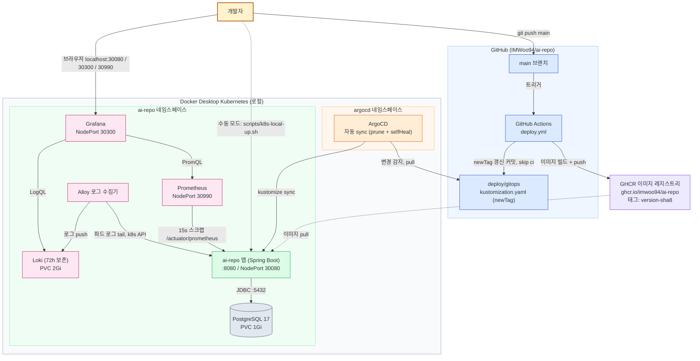
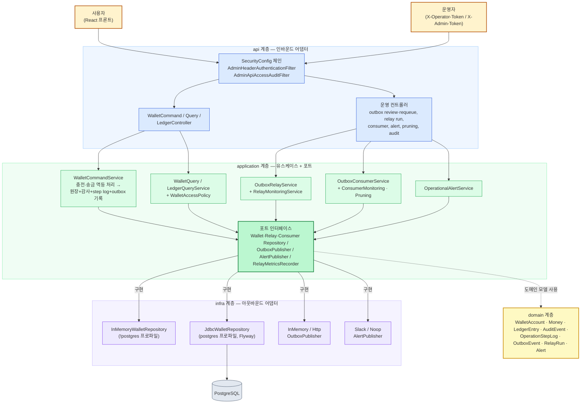
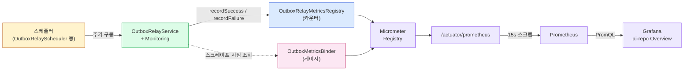
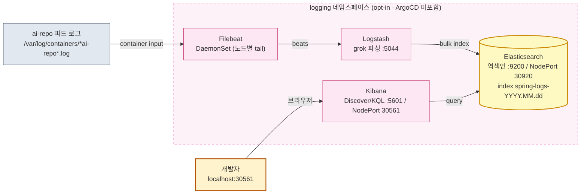

# 아키텍처 다이어그램

인프라(배포·관측)와 내부 애플리케이션 구조를 mermaid로 정리한다. GitHub에서 자동 렌더링된다.

## 1. 인프라 아키텍처

GitOps 파이프라인(main push → GHCR → ArgoCD)과 로컬 Docker Desktop k8s 스택. 점선은 GitOps 대신 쓰는 수동 모드(`scripts/k8s-local-up.sh`)와 이미지 pull 경로.

> 색상: 🟡 개발자 · 🔵 GitHub · 🟣 레지스트리 · 🟠 ArgoCD · 🟢 앱 워크로드 · 🩷 관측(모니터링·로그) · ⚪ 저장소

- 접속 URL·계정: `docs/development/k8s-local-monitoring.md` 접속 정보 표
- 파이프라인 상세: `docs/development/ci-cd-gitops.md`
- 수동 모드와 GitOps 모드는 같은 네임스페이스를 관리하므로 택1

## 2. 애플리케이션 아키텍처 (헥사고날)

`api → application → domain`, 포트 인터페이스를 `infra` 어댑터가 구현한다. 저장소 어댑터는 Spring 프로파일로 교체된다(`!postgres` → InMemory, `postgres` → Jdbc+Flyway).

> 색상: 🟡 액터 · 🔵 api(인바운드) · 🟢 application(유스케이스, 진한 초록 = 포트) · 🟨 domain · 🟣 infra(아웃바운드) · ⚪ DB

- 돈 이동(충전·송금)은 하나의 operation으로 원장 + 감사 로그 + step log + outbox event를 남긴다(증적 원자성).
- 운영 API는 operator(조회)/admin(변경) 토큰과 접근 감사 필터로 보호된다.

## 3. 구동·관측 흐름 (스케줄러 → 지표 → Grafana)

스케줄러가 relay를 주기 구동하고, 지표는 카운터(기록 시점 증가)와 게이지(스크레이프 시점 조회) 두 경로로 Micrometer에 모여 Prometheus → Grafana로 흐른다.

> 색상: 🟡 구동(스케줄러) · 🟢 서비스 · 🔵 카운터 경로(기록 시점) · 🩷 게이지 경로(스크레이프 시점) · 🟣 노출·수집

지표 목록과 대시보드 패널: `docs/development/k8s-local-monitoring.md` Outbox 커스텀 지표 섹션.

## 4. (opt-in) ELK 로그 파이프라인

기본 로그 스택은 PLG(Loki)이며, 학습용으로 **opt-in** ELK 스택을 병존시킬 수 있다. ArgoCD(GitOps)에는 포함하지 않고 `scripts/elk-local-up.sh`로만 수동 기동한다. Filebeat(DaemonSet)가 `ai-repo` 파드 로그를 tail → Logstash가 grok으로 Spring 로그를 파싱 → Elasticsearch 역색인(`spring-logs-YYYY.MM.dd`) → Kibana Discover에서 KQL 검색한다.

> 색상: ⚪ 로그 소스 · 🩷 ELK 컴포넌트(opt-in, 점선 = ArgoCD 미포함 수동 기동) · 🟨 Elasticsearch 역색인 · 🟡 개발자

- grok 파싱에 실패해도 원본 `message`는 유지되어 ES로 전달된다(`_grokparsefailure_spring` 태그).
- 기동/제거·접속 URL·KQL 예시: `docs/development/elk-local-logging.md`, 개념 학습: `docs/learning/elk-stack.md`, 결정 배경: `docs/adr/0066-elk-logging-stack.md`.

## 관련 문서

- `docs/development/k8s-local-monitoring.md` — 접속 정보·명령어·지표·로그 검색
- `docs/development/ci-cd-gitops.md` — 배포 파이프라인·트러블슈팅
- `docs/adr/0059-k8s-deploy-and-observability.md` — 설계 결정
