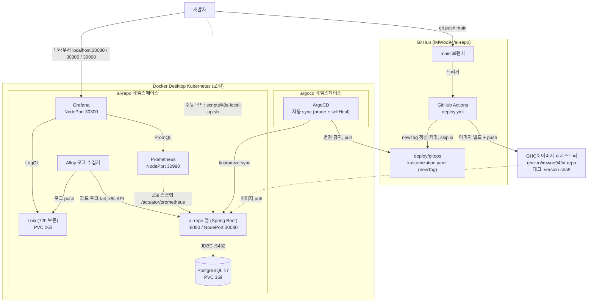
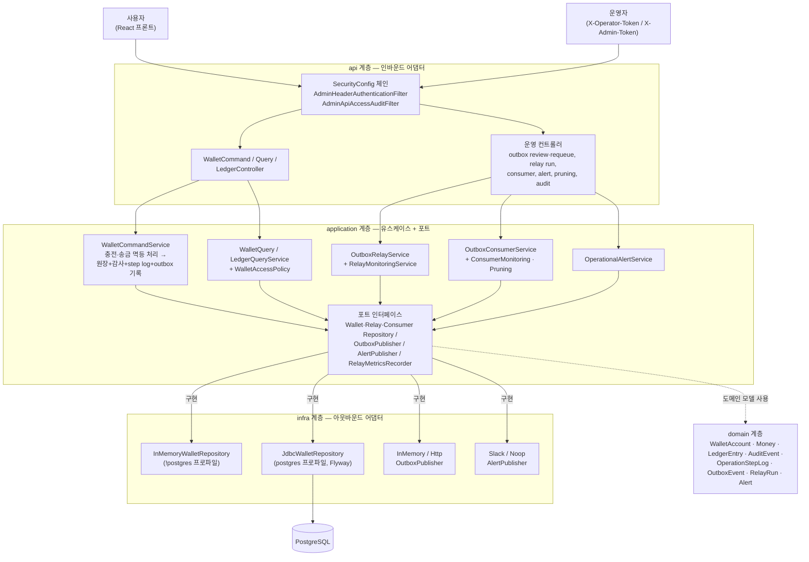
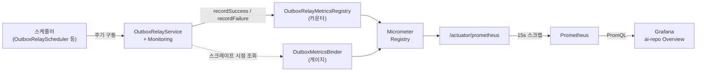

# 아키텍처 다이어그램

인프라(배포·관측)와 내부 애플리케이션 구조를 mermaid로 정리한다. GitHub에서 자동 렌더링된다.

## 1. 인프라 아키텍처

GitOps 파이프라인(main push → GHCR → ArgoCD)과 로컬 Docker Desktop k8s 스택. 점선은 GitOps 대신 쓰는 수동 모드(`scripts/k8s-local-up.sh`)와 이미지 pull 경로.

- 접속 URL·계정: `docs/development/k8s-local-monitoring.md` 접속 정보 표
- 파이프라인 상세: `docs/development/ci-cd-gitops.md`
- 수동 모드와 GitOps 모드는 같은 네임스페이스를 관리하므로 택1

## 2. 애플리케이션 아키텍처 (헥사고날)

`api → application → domain`, 포트 인터페이스를 `infra` 어댑터가 구현한다. 저장소 어댑터는 Spring 프로파일로 교체된다(`!postgres` → InMemory, `postgres` → Jdbc+Flyway).

- 돈 이동(충전·송금)은 하나의 operation으로 원장 + 감사 로그 + step log + outbox event를 남긴다(증적 원자성).
- 운영 API는 operator(조회)/admin(변경) 토큰과 접근 감사 필터로 보호된다.

## 3. 구동·관측 흐름 (스케줄러 → 지표 → Grafana)

스케줄러가 relay를 주기 구동하고, 지표는 카운터(기록 시점 증가)와 게이지(스크레이프 시점 조회) 두 경로로 Micrometer에 모여 Prometheus → Grafana로 흐른다.

지표 목록과 대시보드 패널: `docs/development/k8s-local-monitoring.md` Outbox 커스텀 지표 섹션.

## 관련 문서

- `docs/development/k8s-local-monitoring.md` — 접속 정보·명령어·지표·로그 검색
- `docs/development/ci-cd-gitops.md` — 배포 파이프라인·트러블슈팅
- `docs/adr/0059-k8s-deploy-and-observability.md` — 설계 결정
