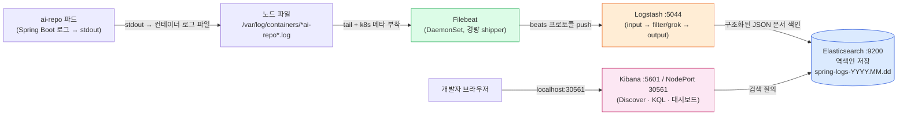
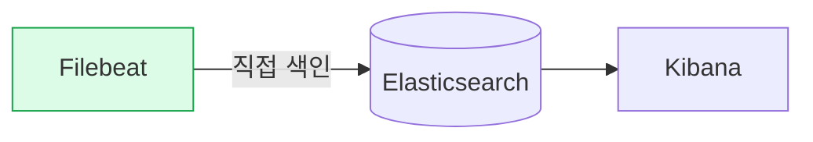
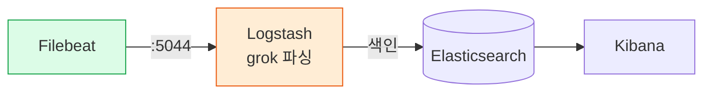
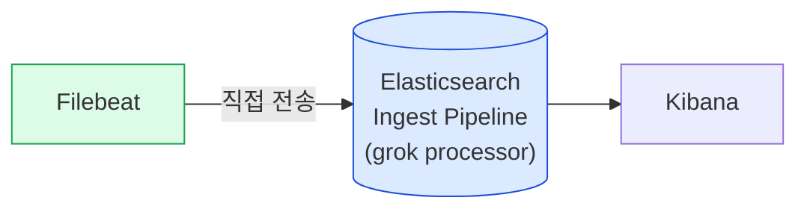

# ELK 로깅 스택 배우기 (Filebeat → Logstash → Elasticsearch → Kibana)

> 이 문서는 ai-repo에 붙어 있는 **학습용 opt-in ELK 스택**을 처음 보는 사람을 위한 튜토리얼입니다. 기존 기본 로그 스택은 PLG(Loki)이고, ELK는 "로그를 다른 방식으로 다뤄보는 실습장"으로 병존합니다. 실제 기동/정리는 `scripts/elk-local-up.sh` / `scripts/elk-local-down.sh`, 매니페스트는 `deploy/k8s/logging/`, 실무 가이드는 [elk-local-logging.md](../development/elk-local-logging.md)를 참고하세요. 도입 배경/결정은 [ADR-0066](../adr/0066-elk-logging-stack.md)에 있습니다.

로그 한 줄이 앱에서 나와서 Kibana 화면에서 검색되기까지, **네 개의 부품**이 릴레이 하듯 로그를 넘깁니다. 이 문서를 다 읽으면 "왜 부품이 네 개나 필요한가", "grok이 도대체 무슨 마법인가", "Loki랑 뭐가 다른가"를 스스로 설명할 수 있게 됩니다.

---

## 1. ELK 4-tier 아키텍처 한눈에 보기

ELK는 원래 **E**lasticsearch + **L**ogstash + **K**ibana 세 글자였는데, 로그를 실어 나르는 경량 수집기 **Filebeat**(Beats 계열)가 합류하면서 사실상 4단(tier) 구조가 되었습니다. 각 단은 "한 가지 일만 잘한다"는 원칙으로 분리돼 있습니다.

| 단(tier) | 부품 | 한 줄 역할 | ai-repo에서 |
| --- | --- | --- | --- |
| 수집 | **Filebeat** | 각 노드에서 로그 파일을 tail 해서 밀어줌 | DaemonSet, `*ai-repo*.log`만 수집 |
| 가공 | **Logstash** | 원본 텍스트를 파싱해 구조화(필드 분리) | grok으로 Spring 로그 분해, :5044 |
| 저장/검색 | **Elasticsearch** | 역색인으로 저장하고 빠른 전문검색 제공 | 인덱스 `spring-logs-YYYY.MM.dd`, :9200 |
| 시각화 | **Kibana** | 검색 UI(Discover/KQL)와 대시보드 | NodePort 30561 |



**왜 이렇게 나눠놨을까?** 각 단을 독립적으로 확장/교체할 수 있기 때문입니다. 로그가 폭증하면 Filebeat는 그대로 두고 Logstash만 늘릴 수 있고, 파싱 규칙을 바꿔도 저장소(ES)는 건드리지 않습니다. 반대로 단이 많다는 건 **운영 부담과 리소스 비용**이 크다는 뜻이기도 합니다(그래서 ai-repo에서는 학습용 opt-in으로만 둡니다).

---

## 2. 컴포넌트 심화

### 2-1. Filebeat — 경량 shipper와 backpressure

Filebeat는 Go로 짜인 **아주 가벼운** 로그 수집기입니다. 하는 일은 단순합니다.

- 지정한 파일들(`/var/log/containers/*ai-repo*.log`)을 계속 열어두고 새 줄이 추가되면 읽어서 다음 단으로 보냄(tail -f 같은 동작).
- **어디까지 읽었는지 offset을 기억**(registry)합니다. 그래서 Filebeat가 재시작돼도 중복/누락 없이 이어서 읽습니다.
- ai-repo에서는 DaemonSet으로 배포돼 **모든 노드에 한 개씩** 뜨고, 그 노드의 컨테이너 로그를 훑습니다. `add_kubernetes_metadata` 프로세서가 파드 이름·네임스페이스 같은 k8s 메타데이터를 로그에 붙여줍니다.

가장 중요한 개념이 **backpressure(역압)**입니다. 다음 단(Logstash)이 느려지거나 잠깐 죽으면 어떻게 될까요? Filebeat는 무작정 밀어붙이지 않고 **전송 속도를 늦추거나 멈춥니다**. 보낸 데이터가 확인(ack)되기 전까지 offset을 전진시키지 않기 때문에, 병목이 풀리면 멈췄던 지점부터 다시 보냅니다. 즉 "로그를 잃지 않으려고 스스로 브레이크를 밟는" 구조입니다. 무거운 Logstash를 앞단에서 얇은 Filebeat가 감싸주는 이유가 이것입니다.

### 2-2. Logstash — input / filter / output 3단 파이프라인

Logstash는 ELK에서 가장 무거운(JVM 기반) 부품이고, 하는 일은 **가공**입니다. 파이프라인은 항상 세 블록으로 이뤄집니다. ai-repo의 `deploy/k8s/logging/logstash.yaml` ConfigMap에 든 `pipeline.conf`가 정확히 이 구조입니다.

```
input  { beats { port => 5044 } }          # 어디서 받나: Filebeat가 5044로 보냄
filter { grok { ... } date { ... } ... }   # 어떻게 가공하나: 텍스트 → 필드
output { elasticsearch { ... } }           # 어디로 보내나: ES 인덱스에 색인
```

- **input**: `beats` 입력으로 Filebeat의 연결을 5044 포트에서 받습니다.
- **filter**: 핵심입니다. `grok`으로 한 줄 문자열을 여러 필드로 쪼개고, `date`로 로그 안의 시간 문자열을 진짜 `@timestamp`로 바꾸고, `mutate`로 공백을 다듬습니다(자세한 건 3장).
- **output**: 가공된 문서를 `http://elasticsearch:9200`의 `spring-logs-%{+YYYY.MM.dd}` 인덱스로 보냅니다. 인덱스 이름에 날짜가 들어가 **하루에 하나씩** 인덱스가 생깁니다(오래된 로그를 날짜 단위로 지우기 쉬움).

### 2-3. Elasticsearch — 역색인 · 샤드 · 인덱스

Elasticsearch는 저장 + 검색 엔진입니다. 세 단어만 이해하면 됩니다.

- **문서(document)**: 로그 한 줄이 JSON 문서 하나입니다. `{ "level": "INFO", "logger": "...", "log_message": "Started ...", "@timestamp": "..." }` 같은 모양.
- **인덱스(index)**: 문서들을 담는 논리적 통. ai-repo에서는 날짜별 `spring-logs-2026.07.04` 형태. (RDB의 "테이블"에 가깝다고 생각하면 편합니다.)
- **샤드(shard)**: 인덱스를 물리적으로 쪼갠 조각. 데이터가 커지면 여러 샤드/노드로 분산해 병렬 검색합니다. (우리 로컬 학습 스택은 단일 노드라 샤드 분산 효과는 크지 않지만 개념은 동일합니다.)

**역색인(inverted index)** 이 ES의 심장입니다. 보통 우리가 아는 색인은 "문서 → 그 안의 단어들"이지만, 역색인은 거꾸로 **"단어 → 그 단어가 등장한 문서 목록"** 을 미리 만들어 둡니다.

```
문서1: "connection timeout error"
문서2: "user timeout retry"

역색인:
  timeout   → [문서1, 문서2]
  error     → [문서1]
  retry     → [문서2]
```

그래서 `timeout`을 검색하면 전체 문서를 훑지 않고 `timeout` 항목만 보면 즉시 [문서1, 문서2]가 나옵니다. 로그 수백만 줄에서 특정 단어를 밀리초 단위로 찾는 비결이 이 미리 만들어 둔 단어 사전입니다. 대신 **색인을 미리 만드는 비용(디스크·CPU)** 이 든다는 트레이드오프가 있습니다 — 이 점이 5장에서 Loki와 갈리는 지점입니다.

### 2-4. Kibana — Discover와 KQL

Kibana는 ES 앞단의 웹 UI입니다. 처음 만질 곳은 **Discover** 화면입니다.

- 먼저 **data view**(예전 이름 index pattern)로 `spring-logs-*`를 등록하면, Kibana가 이 인덱스들의 필드를 읽어 검색 대상으로 삼습니다.
- 검색창에서는 **KQL(Kibana Query Language)** 로 질의합니다. 사람이 읽기 쉬운 문법입니다.
  - `level: ERROR` → level 필드가 ERROR인 로그
  - `log_message: *timeout*` → 메시지에 timeout이 든 로그
  - `level: ERROR and logger: *Wallet*` → 조건 결합
- 시간 범위(우측 상단)로 "최근 15분" 같은 창을 잡고, 히스토그램으로 로그 급증 구간을 눈으로 봅니다.

KQL은 grok이 만들어 준 **필드**(level, logger, log_message 등) 위에서 동작합니다. 즉 3장의 파싱이 잘 돼 있어야 4장 검색이 편해지는, 앞뒤가 연결된 구조입니다.

---

## 3. grok 파싱 원리 — 이 repo의 Spring 로그를 필드로 분해하기

### grok이 하는 일

grok은 **"이름 붙은 정규식 조각"** 을 조립해 한 줄 텍스트에서 값을 뽑아내는 도구입니다. 날것의 정규식은 읽기 괴롭기 때문에, 자주 쓰는 패턴에 `TIMESTAMP_ISO8601`, `LOGLEVEL`, `POSINT` 같은 이름을 미리 붙여두고 `%{패턴이름:필드이름}` 문법으로 씁니다.

- `%{LOGLEVEL:level}` = "여기에 로그레벨 패턴이 오는데, 매치되면 그 값을 `level` 필드에 담아라".
- 매치에 성공하면 그 부분 문자열이 잘려 나와 필드가 되고, 다음 패턴이 그 뒤부터 이어서 매치합니다.

### 실습: ai-repo의 진짜 Spring 로그 한 줄 분해

대상 로그(스펙의 실제 샘플):

```
2026-07-04T09:50:42.320Z  INFO 1 --- [ai-repo] [           main] com.imwoo.airepo.AiRepoApplication       : Started AiRepoApplication in 15.044 seconds
```

`deploy/k8s/logging/logstash.yaml`의 grok 패턴은 이렇습니다:

```
%{TIMESTAMP_ISO8601:log_timestamp}%{SPACE}%{LOGLEVEL:level}%{SPACE}%{POSINT:pid}%{SPACE}---%{SPACE}\[%{DATA:appname}\]%{SPACE}\[%{DATA:thread}\]%{SPACE}%{NOTSPACE:logger}%{SPACE}:%{SPACE}%{GREEDYDATA:log_message}
```

한 조각씩, 로그의 어느 부분을 먹는지 짝지어 보면:

| grok 조각 | 매치하는 부분 | 뽑히는 필드 = 값 |
| --- | --- | --- |
| `%{TIMESTAMP_ISO8601:log_timestamp}` | `2026-07-04T09:50:42.320Z` | `log_timestamp` = 2026-07-04T09:50:42.320Z |
| `%{SPACE}` | (공백들, 우측정렬 패딩 흡수) | — (버림) |
| `%{LOGLEVEL:level}` | `INFO` | `level` = INFO |
| `%{SPACE}` | ` ` | — |
| `%{POSINT:pid}` | `1` | `pid` = 1 |
| `%{SPACE}---%{SPACE}` | ` --- ` | — (구분자, 버림) |
| `\[%{DATA:appname}\]` | `[ai-repo]` | `appname` = ai-repo |
| `%{SPACE}` | ` ` | — |
| `\[%{DATA:thread}\]` | `[           main]` | `thread` = "           main"(공백 포함) |
| `%{SPACE}` | ` ` | — |
| `%{NOTSPACE:logger}` | `com.imwoo.airepo.AiRepoApplication` | `logger` = com.imwoo.airepo.AiRepoApplication |
| `%{SPACE}:%{SPACE}` | `       : ` | — (콜론 구분자) |
| `%{GREEDYDATA:log_message}` | `Started AiRepoApplication in 15.044 seconds` | `log_message` = Started ... seconds |

핵심 포인트 몇 가지:

- **`%{SPACE}` 는 "공백을 먹어치우는" 조각**입니다. Spring 로그는 레벨을 우측정렬(`INFO`, ` WARN`)하고 thread/logger를 공백으로 패딩하기 때문에, 고정 개수의 공백을 쓰면 안 되고 `%{SPACE}`로 가변 공백을 흡수해야 합니다.
- **`\[` `\]` 는 대괄호 자체를 매치**합니다(정규식에서 `[`는 특수문자라 이스케이프). `[ai-repo]`의 바깥 괄호를 소비하고 안쪽 `ai-repo`만 `appname`으로 뽑습니다.
- **`%{DATA}` vs `%{NOTSPACE}` vs `%{GREEDYDATA}`**: `DATA`는 최소 매치(다음 패턴이 나올 때까지만), `NOTSPACE`는 공백 아닌 문자 연속(logger 클래스명에 딱), `GREEDYDATA`는 남은 전부(메시지는 공백이 있으니 끝까지). 순서와 종류를 잘못 고르면 필드가 엉뚱하게 잘립니다.
- 뽑은 뒤 filter에서 `date { match => ["log_timestamp","ISO8601"] target => "@timestamp" }` 로 `log_timestamp`를 진짜 시간축(`@timestamp`)에 심고 원본 필드는 지웁니다. `mutate { strip => [...] }`로 thread/logger/level에 남은 앞뒤 공백을 다듬습니다.

### grok이 실패하면?

패턴과 안 맞는 줄(예: 멀티라인 스택트레이스 조각)이 들어오면 grok은 필드를 못 만들고 `tag_on_failure => ["_grokparsefailure_spring"]` 태그를 붙입니다. **하지만 원본 `message` 필드는 그대로 살아서 ES까지 갑니다.** 즉 파싱에 실패해도 로그를 잃지 않고, Kibana에서 `tags: _grokparsefailure_spring`로 "파싱 못 한 줄"만 골라내 패턴을 고칠 수 있습니다. 이게 "로그는 절대 버리지 않되, 되는 만큼 구조화한다"는 안전한 설계입니다.

---

## 4. 두 가지 토폴로지와 Ingest Pipeline 대안

로그를 ES에 넣는 길은 하나가 아닙니다. 상황에 맞게 고릅니다.

### 토폴로지 A — Filebeat가 ES로 직접 (Logstash 없음)



- **장점**: 부품이 하나 적어 가볍고 단순. Filebeat 자체 모듈이 파싱을 어느 정도 해줌.
- **단점**: 복잡한 커스텀 파싱(우리 Spring grok 같은)이나 여러 소스 합류·변환이 어렵습니다.
- 어울리는 경우: 표준 포맷(nginx, 시스템 로그) + 무거운 가공 불필요.

### 토폴로지 B — Filebeat → Logstash → ES (ai-repo가 택한 길)



- **장점**: Logstash의 grok/date/mutate로 **원하는 대로 파싱·변환**. 학습 목적(파싱을 직접 다뤄보기)에 딱.
- **단점**: JVM 부품 하나가 늘어 리소스·운영 부담 증가.
- ai-repo가 이 길을 택한 이유는 바로 **grok 파싱을 손으로 배우는 것**이 목적이기 때문입니다([ADR-0066](../adr/0066-elk-logging-stack.md)).

### 대안 — Elasticsearch Ingest Pipeline

Logstash를 따로 두지 않고 **ES 안에서** 파싱하는 방법도 있습니다. ES의 Ingest Pipeline에 `grok` processor를 등록하면, Filebeat가 직접 ES로 보내되 색인 직전에 ES가 grok을 돌려 필드를 만듭니다.



- **장점**: 별도 Logstash 파드 없이 grok 파싱을 얻어 가벼움.
- **단점**: 파싱 부하가 ES 노드에 얹혀 검색 성능과 자원을 두고 경합. 복잡한 다단 변환·여러 output은 Logstash가 더 유연.
- 정리: **가벼운 파싱이면 Ingest Pipeline, 무겁고 유연한 파이프라인이면 Logstash.** ai-repo는 "파이프라인을 눈으로 보고 배우기" 위해 Logstash를 명시적으로 둡니다.

---

## 5. PLG(Loki) vs ELK — 역색인 vs 라벨 인덱스

ai-repo의 **기본** 로그 스택은 Loki(PLG: Prometheus/Loki/Grafana/Alloy)입니다. ELK는 그 옆에 붙인 학습용 대안입니다. 둘의 근본 차이는 **"로그 본문을 미리 색인하느냐"** 한 문장으로 요약됩니다.

| 항목 | PLG (Loki) | ELK (Elasticsearch) |
| --- | --- | --- |
| 색인 방식 | **라벨(label)만 색인** — 본문은 압축 저장 | **역색인** — 본문의 단어까지 색인 |
| 검색 | 라벨로 후보를 좁힌 뒤 **본문 grep**(LogQL) | 단어 즉시 조회(**전문검색**, KQL/Lucene) |
| 저장 비용 | 낮음(색인 작음) | 높음(단어 사전이 큼) |
| 임의 단어 검색 속도 | 범위가 넓으면 느림(grep) | 빠름(미리 색인됨) |
| 파싱 시점 | 주로 쿼리 시점(LogQL 파서) | 주로 색인 시점(grok) |
| 수집기 | Alloy | Filebeat |
| 질의어 | LogQL | KQL / Lucene |
| ai-repo에서 | 기본, 항상 켜짐 | opt-in, 학습용 |

**비유로**: Loki는 "책들을 라벨(제목·저자)로만 분류해 서가에 꽂아두고, 특정 서가를 골라 그 책들을 처음부터 읽어 원하는 단어를 찾는" 방식입니다. 색인이 얇아 저렴하지만, 넓은 범위에서 임의 단어를 찾으면 결국 많이 읽어야 합니다. ELK는 "모든 책의 모든 단어로 색인 카드를 미리 만들어 둔 도서관"입니다. 어떤 단어든 카드만 보면 즉시 찾지만, 카드를 만드는 공간·비용이 큽니다.

**언제 뭘 쓰나**: 라벨(네임스페이스·파드·레벨)로 충분히 좁혀지고 비용을 아끼고 싶으면 Loki. 로그 본문을 자유자재로 전문검색·집계·대시보드하고 싶으면 ELK. ai-repo는 평소엔 Loki로 가볍게 가고, "역색인과 grok을 직접 만져보고 싶을 때만" ELK를 opt-in으로 켭니다.

---

## 6. 실습 과제 — 에러 급증을 Kibana에서 찾아내기

배운 걸 손으로 확인해 봅시다. (자세한 명령·트러블슈팅은 [elk-local-logging.md](../development/elk-local-logging.md)를 함께 보세요.)

**목표**: 앱에서 ERROR 로그를 일부러 만들고, Filebeat→Logstash→ES를 타고 흘러온 그 로그를 Kibana에서 검색해 급증 구간을 눈으로 확인한다.

1. **스택 켜기**
   ```bash
   ./scripts/elk-local-up.sh
   ```
   ES → Logstash → Kibana rollout과 Filebeat DaemonSet ready까지 기다린 뒤 접속 URL이 출력됩니다.

2. **Kibana 열고 data view 만들기**
   브라우저에서 `http://localhost:30561` → Discover → data view 생성 시 인덱스 패턴 `spring-logs-*`, 시간 필드 `@timestamp` 선택.

3. **에러를 일부러 유발**
   ai-repo에 없는 리소스를 두들기거나 잘못된 요청을 여러 번 보내 ERROR 로그가 쌓이게 합니다. 예:
   ```bash
   for i in $(seq 1 20); do curl -s -o /dev/null http://localhost:30080/api/does-not-exist; done
   ```
   (엔드포인트는 상황에 맞게 조정. 핵심은 "짧은 시간에 에러 로그를 다발로 만드는 것".)

4. **Kibana에서 검색**
   - 우측 상단 시간 범위를 "Last 15 minutes"로.
   - 검색창: `level: ERROR`
   - 상단 히스토그램에서 방금 만든 **급증 막대**를 확인. 막대를 드래그하면 그 구간으로 줌인됩니다.
   - 특정 메시지만: `level: ERROR and log_message: *not*` 처럼 KQL로 좁혀보기.

5. **파싱 결과 뜯어보기**
   로그 한 건을 펼쳐(expand) `level`, `logger`, `thread`, `log_message`, `@timestamp` 필드가 grok으로 잘 분리됐는지 확인합니다. 만약 `tags`에 `_grokparsefailure_spring`이 보이면, 그 줄은 패턴과 안 맞은 것 — 원본 `message`는 살아 있으니 패턴을 어떻게 고칠지 생각해 봅니다(3장 복습).

6. **정리**
   ```bash
   ./scripts/elk-local-down.sh
   ```

**확장 도전**: `level: ERROR`를 Loki(Grafana, LogQL `{namespace="ai-repo"} |= "ERROR"`)에서도 같은 걸 찾아보고, 두 검색 경험(라벨+grep vs 역색인 전문검색)이 어떻게 다른지 5장과 대조해 보세요.

---

## 더 읽을거리

- [ADR-0066: ELK 로깅 스택 도입](../adr/0066-elk-logging-stack.md) — 왜 도입했고 PLG와 어떻게 병존하는지
- [로컬 ELK 로깅 가이드](../development/elk-local-logging.md) — 실제 기동·검색·트러블슈팅, LogQL↔KQL 치트시트
- [Architecture Overview](../ARCHITECTURE.md) · [Glossary](../GLOSSARY.md)
- 매니페스트: `deploy/k8s/logging/` · 스크립트: `scripts/elk-local-up.sh`, `scripts/elk-local-down.sh`
